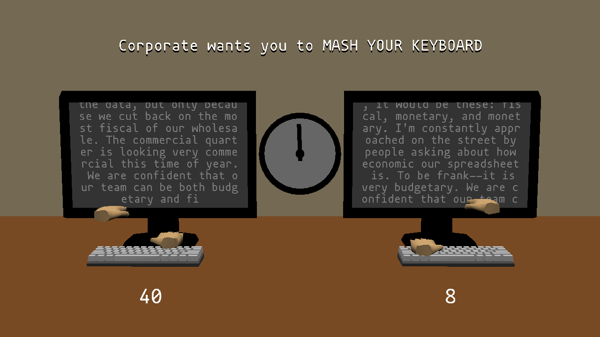

# Corporate Culture

Author: Eric Schneider, Pablo Wilson

Design: Corporate wants their quarterly report and your job is at stake! Compete against your coworker mashing that report out as fast as possible before time runs out, you don't want to be the one fired!'

Networking: Each client transmits a short message stating how many keys they've mashed and how many points they got. The server sends the current score, time remaining, and new characters mashed out so that the clients can render eachother's text.

Unfortunately, I ran into some major bugs very close to the deadline and was unable to find a proper fix. The bytes were being sent and received correctly, but the way I was interpreting them back into uint32_t was incorrect in some way, so I had to quickly rip out large sections of code to get a slightly working version:(

Screen Shot:

How To Play:

Mash keys as fast as you can!

First client to connect crashes, current workaround is just start up client 2 and 3, those currently work.

Sources: Keyboard Model
https://sketchfab.com/3d-models/keyboard-ba869e8681974cf088736173b8b86fef
CC Attribution (sketchfab user A5PERA)

Hand Model
https://sketchfab.com/3d-models/free-low-poly-hands-models-5e02664ad4f241c8aed4bebc88a09319
CC Attribution (sketchfab user GR.blend)

Monitor Model
https://sketchfab.com/3d-models/householdpropschallenge-04-monitor-50d20afcff9c4e60aea45514e0de1327
CC Attribution (sketchfab user beagleknight)

Font
https://github.com/madmalik/mononoki/blob/master/LICENSE

This game was built with [NEST](NEST.md).

